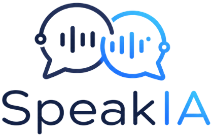

<p align="center">
  
</p>

<h1 align="center">SpeakAI</h1>

<p align="center">
  Aplicación de escritorio para aprender idiomas mediante conversación real con IA.
</p>

<p align="center">
  
  
  
  
  
  
</p>

<p align="center">
  🌐 &nbsp;
  <a href="../../README.md"> English</a>
  &nbsp;|&nbsp;
  <a href="../pt-br/README.md"> Português</a>
  &nbsp;|&nbsp;
  <a href="README.md"> Español</a>
</p>

<p align="center">
  <a href="TECHNICAL.md">Referencia Técnica</a>
</p>

---

## ¿Qué es SpeakAI?

SpeakAI es una aplicación de escritorio construida con Electron que te pone en una conversación real con una IA que habla, escucha y corrige tu gramática — todo en el idioma que estás aprendiendo. Combina tres APIs (OpenAI y ElevenLabs) en una experiencia integrada:

| Modo | Qué hace |
|---|---|
| **Entrenamiento Textual** | Chat con la IA; las correcciones gramaticales aparecen en un panel lateral |
| **Conversación por Voz** | Graba tu voz, recibe transcripción y respuesta en audio |
| **Opciones** | Personaliza el nombre de la IA, temas, idiomas, claves de API y dificultad |

---

## Funcionalidades

- **30 idiomas** de entrenamiento (inglés, portugués, español, francés, alemán, italiano, japonés, chino y más)
- **Panel de corrección gramatical** que funciona en paralelo en cada mensaje
- **Efecto de escritura** — el texto de la IA aparece palabra a palabra, como si estuviera escribiendo en tiempo real
- **Tarjeta de corrección** en cada burbuja del usuario — muestra la versión corregida con notas explicativas
- **Botón de traducción inline** en cada mensaje de la IA — clic para revelar, otro clic para ocultar
- **Historial de conversaciones** — accede a resúmenes de sesiones anteriores desde el encabezado del panel
- **Memoria de conversaciones** — las sesiones anteriores se resumen y reutilizan como contexto para la IA
- **Reproductor de audio personalizado** con barra de progreso, control de tiempo y botón de silencio
- **3 temas visuales** — Studio, Night, Forest — con vista previa en tiempo real
- **Detección del idioma del SO** — el idioma de la interfaz se configura automáticamente al primer inicio
- **Barra lateral contraíble** con estado persistido entre sesiones
- **Claves de API desde la GUI** — con indicador de estado y aviso antes de sobrescribir claves existentes

---

## Inicio Rápido

**Requisitos:** Node.js 18+, una clave de OpenAI, una clave de ElevenLabs (para voz).

```bash
# 1. Instalar dependencias
npm install

# 2. Configurar claves de API
copy .env.example .env
# Edita el .env y rellena OPENAI_API_KEY y ELEVENLABS_API_KEY

# 3. Iniciar
npm run start
```

> **Acceso directo en Windows:** haz doble clic en `start_speakai.bat` — instala e inicia automáticamente.
>
> También puedes configurar las claves directamente desde la pestaña **Opciones** dentro de la aplicación, sin tocar el `.env`.

---

## Estructura del Proyecto

```
SpeakAI/
│
├── src/                          # Proceso principal de Electron (Node.js)
│   ├── main.js                   # Bootstrap, BrowserWindow, manejadores IPC
│   ├── preload.js                # Puente de contexto — expone speakAI.* al renderer
│   ├── config/
│   │   └── config-store.js       # Lee y valida config.json
│   ├── clients/
│   │   ├── openai-client.js      # Whisper STT · Responses API LLM · llamadas TTS
│   │   └── translation-client.js # Google Translate (@vitalets/google-translate-api)
│   └── conversation/
│       ├── orchestrator.js       # Orquesta cada turno de conversación
│       ├── conversation-memory-orchestrator.js  # Finaliza y resume sesiones
│       ├── memory-store.js       # Lee/escribe ai_memory/talk_N.txt
│       └── local-grammar-engine.js  # Corrector gramatical local sin API
│
├── GUI/                          # Proceso renderer (HTML + Vanilla JS, sin bundler)
│   ├── index.html                # Shell de la app — carga scripts en orden correcto
│   ├── renderer.js               # Punto de entrada: bindEvents() + init()
│   ├── core/
│   │   ├── app-state.js          # Objeto de estado global, caché DOM, constantes
│   │   └── ui-utils.js           # setStatus, setBusy, toasts, i18n, barra, pestañas
│   ├── modules/
│   │   ├── options-manager.js    # Validación de config, formulario de opciones, chips
│   │   └── chat-session.js       # Mensajes, efecto de escritura, grabación, turnos
│   └── i18n/
│       └── translations.js       # Cadenas de UI para 6 idiomas (objeto TRANSLATIONS)
│
├── styles/
│   └── main.css                  # Tokens de diseño (CSS vars), temas, layout, componentes
│
├── docs/
│   ├── pt-br/README.md           # Documentación en portugués
│   ├── pt-br/TECHNICAL.md        # Referencia técnica en portugués
│   ├── en-us/README.md           # Documentación en inglés
│   ├── en-us/TECHNICAL.md        # Referencia técnica en inglés
│   ├── es-es/README.md           # Este archivo
│   └── es-es/TECHNICAL.md        # Referencia técnica en español
│
├── assets/                       # Logos e iconos
├── ai_memory/                    # Resúmenes de conversaciones (talk_N.txt)
├── config.json                   # Config central: prompts, modelos, idiomas, temas, voces
├── .env                          # Claves de API — nunca incluir en commits
├── .env.example                  # Plantilla del .env
├── package.json
└── start_speakai.bat             # Bootstrap Windows con un clic
```

---

## Configuración (`config.json`)

Todo el comportamiento funcional se controla desde `config.json` — sin necesidad de modificar código:

| Sección | Qué controla |
|---|---|
| `app` | Nombre predeterminado de la IA, idioma, voz, tema y dificultad |
| `languages` | Los 30 idiomas de entrenamiento (BCP-47, label, código ISO 639-1) |
| `difficultyLevels` | Principiante / Intermedio / Avanzado |
| `themes` | Studio / Night / Forest — cada uno con tokens CSS completos |
| `voices` | Voces de ElevenLabs con mapeo de idiomas compatibles |
| `prompts` | Instrucciones base del LLM para modo texto y modo voz |
| `translation` | Habilitado por defecto, idioma objetivo predeterminado |
| `ui` | Reproducción automática de audio, tipo MIME de grabación |

---

## Orden de Carga de Scripts (GUI)

El renderer no usa bundler — los scripts comparten el ámbito global y deben cargarse en este orden exacto:

```
i18n/translations.js        →  objeto TRANSLATIONS (cadenas para 6 idiomas)
core/app-state.js           →  state, elements, constantes de almacenamiento
core/ui-utils.js            →  setStatus, setBusy, showToast, tr(), applyUiLanguage
modules/options-manager.js  →  validación de config, formulario, selects, chips
modules/chat-session.js     →  mensajes, efecto de escritura, grabación, turnos
renderer.js                 →  bindEvents(), init()  ← punto de entrada, cargado último
```

---

## Flujo de Interacción (Modo Texto)

```
Usuario escribe → textSendButton.click
  → runSessionTurn()
    → inserta mensaje del usuario en el chat
    → muestra indicador de escritura animado
    → window.speakAI.processTurn() [IPC]
      → orchestrator.js → openai-client.js (LLM + corrección en paralelo)
    → devuelve assistantText + correction + translatedText
  → addChatMessage() revela respuesta con efecto de escritura
  → addUserCorrectionIcon() añade ícono de corrección al mensaje del usuario
  → renderCorrectionBox() muestra retroalimentación gramatical
```

---

## Flujo de Interacción (Modo Voz)

```
speechRecordButton.click
  → handleSpeechRecordingToggle()
    → getUserMedia() → MediaRecorder inicia
  → [2.º clic] MediaRecorder detiene
    → blob de audio → arrayBuffer
    → window.speakAI.transcribeAudio() [IPC → Whisper]
    → transcripción → runSessionTurn() (mismo flujo que modo texto)
      → backend genera audio via ElevenLabs
      → reproductor personalizado carga y reproduce automáticamente
```

---

## Cómo Funciona la Memoria de Conversaciones

1. El usuario hace clic en **Nueva Conversación** (o cierra la app)
2. El historial actual se envía a `window.speakAI.finalizeConversation()`
3. El LLM genera un resumen compacto de la sesión
4. El resumen se guarda en `ai_memory/talk_N.txt`
5. En la siguiente sesión, todos los `talk_*.txt` se cargan como `memoryContext` y se inyectan en el prompt del sistema

Puedes revisar las conversaciones guardadas desde el ícono de reloj (⏱) en el encabezado de cada panel.

---

## Referencias de API

- [OpenAI Speech-to-Text](https://platform.openai.com/docs/guides/speech-to-text)
- [OpenAI Responses API](https://platform.openai.com/docs/guides/responses-vs-chat-completions)
- [ElevenLabs Text-to-Speech](https://elevenlabs.io/docs/api-reference/text-to-speech/convert)

---

<p align="center">
  Hecho con ❤️ por <a href="https://github.com/le0nardomartins">le0nardomartins</a>
</p>
